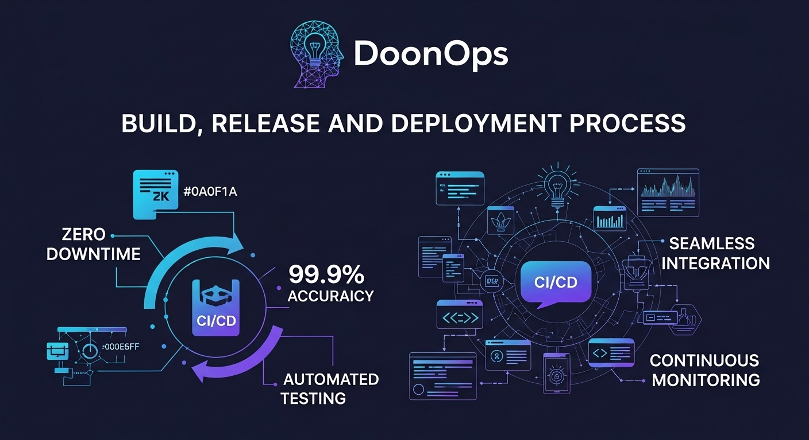

  

<h1 align="center">🚀 DoonOps Inc.</h1>

  <em>Engineering Cloud, AI, Data & Digital Platforms for the Modern Enterprise</em>

  🌐 <a href="https://doonops.com">doonops.com</a> &nbsp;•&nbsp;
  ✉️ <a href="mailto:contact@doonops.com">contact@doonops.com</a>

---

## 🌟 About DoonOps

**DoonOps** is a technology & engineering company focused on building  
**scalable, secure, automated, and intelligent systems** for startups, enterprises, and fast-growing teams.

We operate at the intersection of  
**Cloud Infrastructure, DevOps Automation, Generative AI, Data Engineering, and Full-Stack Development**.

Our philosophy is simple:

> **Build systems the way real companies run them — production-ready, observable, secure, and future-proof.**

---

## 🚀 Our Services

<table>
  <tr>
    <td width="33%" align="center">
      
      <h4>Cloud & Platform Engineering</h4>
      

        Cloud architecture, migrations, modernization, and multi-cloud platforms
        designed for scalability, reliability, and cost efficiency.
      

    </td>
    <td width="33%" align="center">
      
      <h4>DevOps & CI/CD Automation</h4>
      

        CI/CD pipelines, GitOps, Infrastructure as Code, policy-driven deployments,
        and automation across environments.
      

    </td>
    <td width="33%" align="center">
      
      <h4>Kubernetes & Cloud Operations</h4>
      

        Production-grade Kubernetes, SRE practices, observability,
        scaling strategies, and cloud operations.
      

    </td>
  </tr>

  <tr>
    <td width="33%" align="center">
      
      <h4>Generative AI & AI Platforms</h4>
      

        LLM-powered applications, RAG pipelines, AI assistants,
        MLOps workflows, and secure AI deployment.
      

    </td>
    <td width="33%" align="center">
      
      <h4>Data Engineering & Analytics</h4>
      

        Modern data platforms, ETL/ELT pipelines, streaming systems,
        lakehouse architectures, and analytics.
      

    </td>
    <td width="33%" align="center">
      
      <h4>Full-Stack & SaaS Engineering</h4>
      

        Secure, scalable web & mobile platforms with modern frontend,
        backend, API, and microservices architectures.
      

    </td>
  </tr>
</table>

---

## 🎓 Training, Industrial Projects & Internships

At **DoonOps**, learning happens through **real systems, not toy examples**.  
We design programs that mirror **industry workflows, tooling, and expectations**.

<table>
  <tr>
    <td width="33%" align="center">
      
      <h4>DevOps & Cloud Training</h4>
      

        CI/CD, Kubernetes, cloud platforms, IaC, security, SRE,
        and real production architectures.
      

    </td>
    <td width="33%" align="center">
      
      <h4>AI & Generative AI Training</h4>
      

        LLMs, RAG systems, AI deployment, MLOps, prompt engineering,
        and AI security practices.
      

    </td>
    <td width="33%" align="center">
      
      <h4>Industrial Project Training</h4>
      

        Guided industry-grade projects covering cloud, AI, data,
        and full-stack systems with DevOps automation.
      

    </td>
  </tr>

  <tr>
    <td width="33%" align="center">
      
      <h4>Internships & Apprenticeships</h4>
      

        Structured internships with real deliverables,
        mentorship, and exposure to production environments.
      

    </td>
    <td width="33%" align="center">
      
      <h4>Corporate Upskilling</h4>
      

        Enterprise-focused training programs aligned to
        internal tooling, compliance, and scale.
      

    </td>
    <td width="33%" align="center">
      
      <h4>Mentorship & Career Guidance</h4>
      

        Architecture reviews, mock interviews,
        career roadmaps, and technical mentoring.
      

    </td>
  </tr>
</table>

---

## 🌍 Platforms We Build On

<table>
  <tr>
    <td align="center"> AWS</td>
    <td align="center"> Azure</td>
    <td align="center"> GCP</td>
    <td align="center"> Kubernetes</td>
  </tr>
</table>

---

## 🛠️ Core Technology Stack

<table>
  <tr>
    <td>Docker</td><td>Kubernetes</td><td>Terraform</td><td>Ansible</td><td>Pulumi</td>
  </tr>
  <tr>
    <td>GitHub Actions</td><td>Jenkins</td><td>ArgoCD</td><td>Helm</td><td>GitOps</td>
  </tr>
  <tr>
    <td>Python</td><td>Java</td><td>Spring Boot</td><td>Node.js</td><td>React</td>
  </tr>
  <tr>
    <td>LLMs</td><td>RAG</td><td>Vector DBs</td><td>Kafka</td><td>Spark</td>
  </tr>
</table>

---

## ⚙️ How We Work

<table>
  <tr>
    <td width="33%" align="center">
      
      <h4>Discover & Design</h4>
      

        Deep discovery, architecture reviews,
        security & cost assessments.
      

    </td>
    <td width="33%" align="center">
      
      <h4>Build & Automate</h4>
      

        Everything as code — infrastructure,
        pipelines, platforms, and AI workflows.
      

    </td>
    <td width="33%" align="center">
      
      <h4>Operate & Optimize</h4>
      

        Observability, reliability,
        performance tuning, and cost governance.
      

    </td>
  </tr>
</table>

---

## ✨ What Sets DoonOps Apart

- 🤖 **AI-First Engineering**
- 🛡️ **Security by Design**
- ☁️ **Multi-Cloud & Vendor Neutral**
- 📊 **Data-Driven Operations**
- 🚀 **Production-Grade Mindset**

---

## 🤝 Work With DoonOps

We work with:
- Startups scaling fast  
- Enterprises modernizing platforms  
- Teams adopting DevOps & AI  
- Students & engineers building real skills  

📬 **contact@doonops.com**  
🌐 **https://doonops.com**

---

  <b>Build smarter • Scale faster • Operate securely</b> 
  <em>Powered by DoonOps</em>

